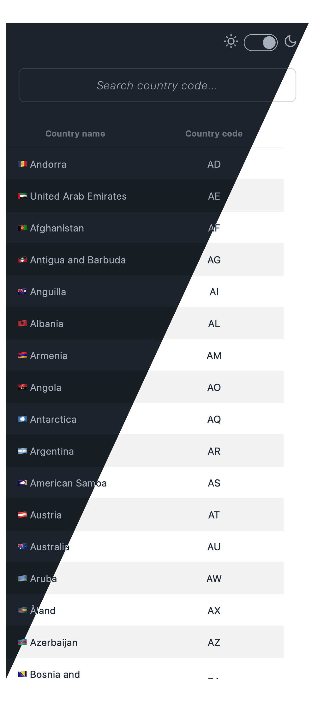

## Country code lookup



### Description

SPA web resource for looking up countries by their country code

### Live instance

Working version can be found at [https://countrycodelookup.simlabs.dev](https://countrycodelookup.simlabs.dev)

### Development

Clone the repository, navigate inside and run:

```sh
npm i(nstall)
npm run dev
```

The app is going to be available on http://localhost:5173 (unless configured otherwise)

### Production

Build the project and deploy to the provider of your choice

```sh
npm i(nstall)
npm run build
```

Another option is to run the application via Docker

First, adjust the Dockerfile to your needs, if necessary, and then build an image:

**_NOTE_**: _[Docker](https://www.docker.com/get-started/) should be installed on your system_

```sh
docker build -t [IMAGE_NAME]:[IMAGE_TAG] .
```

After build process is completed you can run the app by spinning up a container:

```sh
# adjust the internal port (3000) according to your Dockerfile
docker run --name [CONTAINER_NAME] -p [EXTERNAL_PORT]:3000 -d [IMAGE_NAME]:[IMAGE_TAG]
```

A production version of the app is now vailable on port **[EXTERNAL_PORT]**

### Testing

The app uses Vitest and React Testing Library for testing

To run tests:

```sh
npm run test
```

### Sources

This app uses a public GraphQL endpoint https://countries.trevorblades.com/

### Notes

App was originally a test assignment for a job position

### License

MIT License

Permission is hereby granted, free of charge, to any person obtaining a copy
of this software and associated documentation files (the "Software"), to deal
in the Software without restriction, including without limitation the rights
to use, copy, modify, merge, publish, distribute, sublicense, and/or sell
copies of the Software, and to permit persons to whom the Software is
furnished to do so, subject to the following conditions:

The above copyright notice and this permission notice shall be included in all
copies or substantial portions of the Software.

THE SOFTWARE IS PROVIDED "AS IS", WITHOUT WARRANTY OF ANY KIND, EXPRESS OR
IMPLIED, INCLUDING BUT NOT LIMITED TO THE WARRANTIES OF MERCHANTABILITY,
FITNESS FOR A PARTICULAR PURPOSE AND NONINFRINGEMENT. IN NO EVENT SHALL THE
AUTHORS OR COPYRIGHT HOLDERS BE LIABLE FOR ANY CLAIM, DAMAGES OR OTHER
LIABILITY, WHETHER IN AN ACTION OF CONTRACT, TORT OR OTHERWISE, ARISING FROM,
OUT OF OR IN CONNECTION WITH THE SOFTWARE OR THE USE OR OTHER DEALINGS IN THE
SOFTWARE.

### Author

Dmitri Sim
